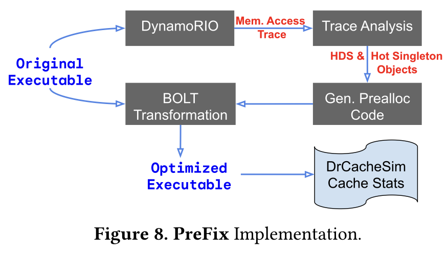

# PreFix: Heap Layout Optimization

A reproduction of **PreFix (CGO 2025)** on the Olden `health` benchmark.
PreFix profiles heap accesses, groups frequently accessed objects, and
rewrites allocation sites using LLVM-BOLT to improve data locality.

[Paper](https://dl.acm.org/doi/10.1145/3696443.3708960)

## Implementation



*Figure 8 from the PreFix paper.*

- `tracer/` — DynamoRIO heap-allocation and access tracing.
- `scripts/` — Hot-data-stream analysis, layout generation, and measurement.
- `patches/prefix.patch` — LLVM-BOLT allocation and free-call rewriting.

## Measured performance

Olden `health`, input `5 5000 4`. Measurements use `perf stat -r N`.
The baseline has no PreFix preallocation or BOLT transformation.

| Metric | Baseline | PreFix | Reduction |
|---|---:|---:|---:|
| Execution time | 67.78 s | 39.14 s | **42.26%** |
| CPU cycles | 233.36 billion | 134.73 billion | **42.27%** |
| Cache misses | 822.88 million | 714.33 million | **13.19%** |
| dTLB load misses | 401.50 million | 344.53 million | **14.19%** |

**1.73× speedup on the machine below.** Results depend on hardware and
system load; these measurements cover one benchmark, not the full paper evaluation.

**Machine:** 2× Intel Xeon Silver 4214R @ 2.40 GHz, 24 cores / 48 threads,
94 GiB RAM. Arch Linux, kernel 6.17.5; GCC 16.1.1.
THP enabled (`always`), CPU governor `schedutil`.

## Reproduce

Requires Linux x86-64, Git, CMake, Ninja, Make, a C compiler,
Python with NumPy, curl, perf, and llvm-symbolizer or addr2line.

```bash
./reproduce_prefix_health.sh
```

The first run builds LLVM-BOLT from source.

- **LLVM/BOLT revision:** `94ae3dd241ad9f1d8cf11720fadd68b50236d4f9` —
  the revision `patches/prefix.patch` was developed and verified against.
- **Benchmark:** Olden `health`, downloaded from `llvm-test-suite` at
  `b93f949ca6c38da7cf2eea708b5a86a4a5c9f30b`. Each downloaded file is
  verified against a recorded SHA-256.
- **Profiling input:** `5 500 4`; **measurement input:** `5 5000 4`.

For a quick analysis and code-generation check:

```bash
python3 tests/test_offline.py
```

## Attribution

Uses LLVM/BOLT and DynamoRIO. Olden `health` is downloaded at runtime
with its license and copyright notices; benchmark sources are not bundled.
